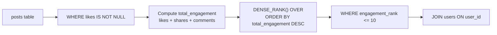
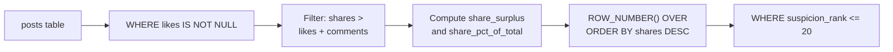
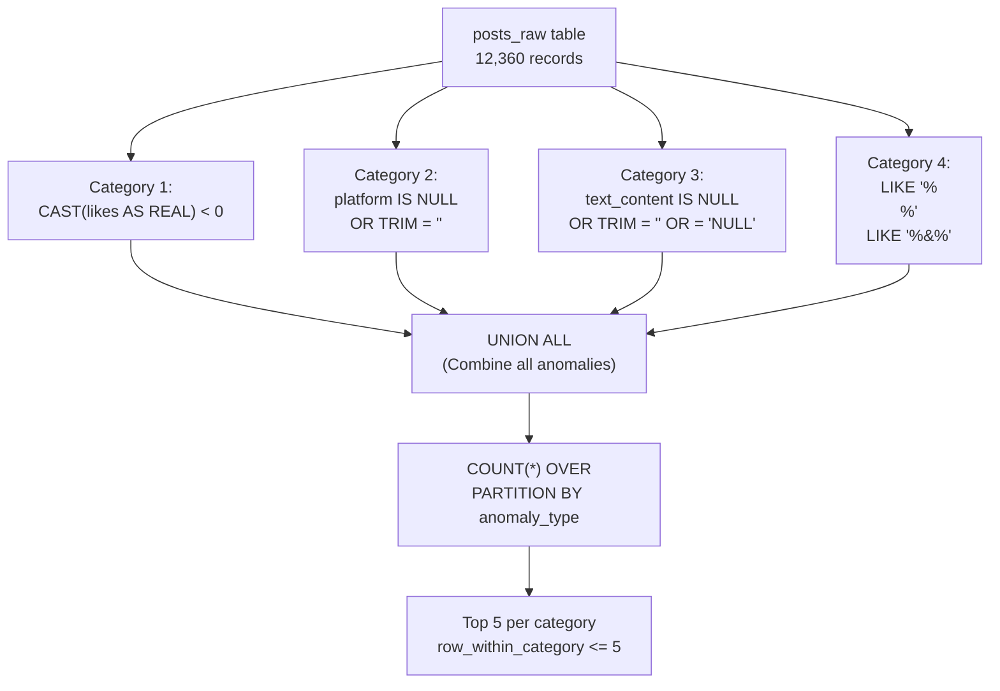
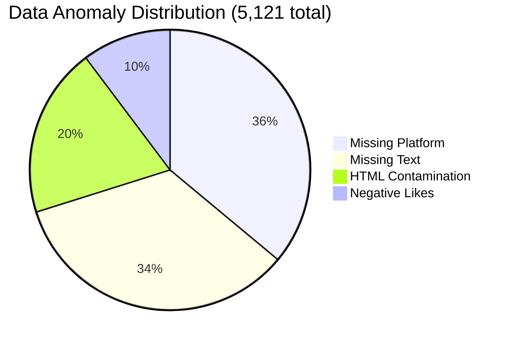
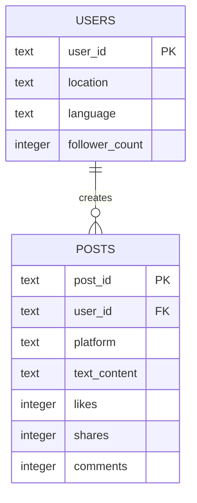

# Phase 2: SQL Rebuild & Analytical Reasoning — Complete Submission

> **Competition**: Data Vortex - Aaruush '26, Round 1, Phase 2
> **Selected Questions**: E2 (Easy) | M5 (Medium) | H5 (Hard)
> **Execution Script**: [`phase2_execute.py`](file:///c:/Users/abc/Downloads/Unstop%20Competitions/Data%20Vortex/phase2_execute.py)

---

# DELIVERABLE 1: PRODUCTION SQL QUERIES

---

## E2: Most Engaged Posts (EASY)

> Find the top 10 posts based on likes + shares + comments. Ignore posts with missing likes.

```sql
-- =====================================================================
-- E2: MOST ENGAGED POSTS
-- =====================================================================
-- GOAL: Identify the top 10 most engaged posts by total engagement
--        score (likes + shares + comments). Posts with NULL likes are
--        excluded since their engagement score is indeterminate.
--
-- TECHNIQUE: Filtered aggregation with ORDER BY DESC + LIMIT
-- ANSI COMPLIANCE: Standard SQL, no vendor-specific extensions
-- =====================================================================

WITH engagement_scored AS (
    -- Step 1: Compute total engagement for each post,
    --         filtering out records where likes data is missing.
    SELECT
        p.post_id,
        p.user_id,
        p.platform,
        SUBSTR(p.text_content, 1, 80)       AS text_preview,
        CAST(p.likes AS INTEGER)             AS likes,
        p.shares,
        p.comments,
        -- Core engagement formula: sum of all three interaction metrics
        (CAST(p.likes AS INTEGER) + p.shares + p.comments)
                                             AS total_engagement,
        u.location,
        u.language,
        u.follower_count
    FROM posts p
    JOIN users u ON p.user_id = u.user_id
    WHERE p.likes IS NOT NULL  -- Exclude posts with missing likes
),
ranked_posts AS (
    -- Step 2: Rank posts by total engagement using a window function.
    --         DENSE_RANK ensures tied engagement scores share the same rank.
    SELECT
        *,
        DENSE_RANK() OVER (
            ORDER BY total_engagement DESC
        ) AS engagement_rank
    FROM engagement_scored
)
-- Step 3: Return only the top 10 most engaged posts.
SELECT
    engagement_rank,
    post_id,
    user_id,
    platform,
    text_preview,
    likes,
    shares,
    comments,
    total_engagement,
    location,
    follower_count
FROM ranked_posts
WHERE engagement_rank <= 10
ORDER BY engagement_rank ASC, total_engagement DESC;
```

---

## M5: Detect Suspicious Engagement (MEDIUM)

> Find posts where shares > likes + comments combined. Return top 20 sorted by shares descending.

```sql
-- =====================================================================
-- M5: DETECT SUSPICIOUS ENGAGEMENT
-- =====================================================================
-- GOAL: Flag posts exhibiting suspicious engagement patterns where
--        shares exceed the combined total of likes and comments.
--        This is a classic bot/manipulation indicator: organic posts
--        rarely have more shares than likes+comments combined.
--
-- TECHNIQUE: CTE with computed inequality filter + ratio analysis
-- WINDOW FUNCTION: PERCENT_RANK to show how extreme each case is
-- =====================================================================

WITH suspicious_posts AS (
    -- Step 1: Identify posts where shares exceed likes + comments.
    --         Only consider posts with non-null likes for fair comparison.
    SELECT
        p.post_id,
        p.user_id,
        p.platform,
        SUBSTR(p.text_content, 1, 60)       AS text_preview,
        CAST(p.likes AS INTEGER)             AS likes,
        p.shares,
        p.comments,
        (CAST(p.likes AS INTEGER) + p.comments)
                                             AS likes_plus_comments,
        -- Share surplus: how much shares exceed likes+comments
        (p.shares - (CAST(p.likes AS INTEGER) + p.comments))
                                             AS share_surplus,
        -- Share-to-engagement ratio: proportion of total from shares
        ROUND(
            CAST(p.shares AS REAL) /
            NULLIF(CAST(p.likes AS INTEGER) + p.shares + p.comments, 0)
            * 100, 1
        )                                    AS share_pct_of_total,
        u.location,
        u.follower_count
    FROM posts p
    JOIN users u ON p.user_id = u.user_id
    WHERE p.likes IS NOT NULL
      AND p.shares > (CAST(p.likes AS INTEGER) + p.comments)
),
ranked_suspicious AS (
    -- Step 2: Rank suspicious posts by share volume and compute
    --         percentile to measure how extreme the anomaly is.
    SELECT
        *,
        ROW_NUMBER() OVER (
            ORDER BY shares DESC
        )                                    AS suspicion_rank,
        ROUND(
            PERCENT_RANK() OVER (
                ORDER BY share_surplus ASC
            ) * 100, 1
        )                                    AS surplus_percentile
    FROM suspicious_posts
)
-- Step 3: Return the top 20 most suspicious posts.
SELECT
    suspicion_rank,
    post_id,
    user_id,
    platform,
    text_preview,
    likes,
    shares,
    comments,
    likes_plus_comments,
    share_surplus,
    share_pct_of_total,
    location,
    follower_count
FROM ranked_suspicious
WHERE suspicion_rank <= 20
ORDER BY suspicion_rank ASC;
```

---

## H5: Identify Data Anomalies (HARD)

> Identify corrupted records matching: negative likes, missing platforms, missing text, or text containing HTML entities/tags.

```sql
-- =====================================================================
-- H5: IDENTIFY DATA ANOMALIES
-- =====================================================================
-- GOAL: Perform a comprehensive data integrity audit by identifying
--        all corrupted records across four anomaly categories:
--        1. Negative likes (sign corruption in numeric fields)
--        2. Missing platform metadata (NULL or empty)
--        3. Missing text content (NULL, empty, or literal 'NULL')
--        4. HTML contamination (tags like <br>, <div> or entities
--           like &amp; embedded in text fields)
--
-- TECHNIQUE: UNION ALL of four independent anomaly scans, each
--            tagged with its anomaly type. This enables both
--            per-category and aggregate analysis.
-- WINDOW FUNCTION: COUNT OVER() for running totals per type.
-- NOTE: Runs against the RAW corrupted source data (posts_raw),
--       NOT the cleaned dataset, to detect all original anomalies.
-- =====================================================================

WITH anomaly_scan AS (
    -- Category 1: NEGATIVE LIKES
    -- Engagement metrics should never be negative. Negative values
    -- indicate sign-corruption during data transfer or ETL failure.
    SELECT
        post_id, user_id, platform,
        SUBSTR(text_content, 1, 50)          AS text_preview,
        likes                                AS flagged_value,
        'NEGATIVE_LIKES'                     AS anomaly_type,
        'Engagement metric has impossible negative value'
                                             AS anomaly_description
    FROM posts_raw
    WHERE CAST(likes AS REAL) < 0

    UNION ALL

    -- Category 2: MISSING PLATFORM
    -- Platform field is NULL, empty, or contains the literal 'NULL'.
    SELECT
        post_id, user_id, platform,
        SUBSTR(text_content, 1, 50)          AS text_preview,
        platform                             AS flagged_value,
        'MISSING_PLATFORM'                   AS anomaly_type,
        'Platform metadata is absent or null-string'
                                             AS anomaly_description
    FROM posts_raw
    WHERE platform IS NULL
       OR TRIM(platform) = ''
       OR TRIM(UPPER(platform)) = 'NULL'

    UNION ALL

    -- Category 3: MISSING TEXT CONTENT
    -- Text content is NULL, empty, or the literal string 'NULL'.
    SELECT
        post_id, user_id, platform,
        SUBSTR(text_content, 1, 50)          AS text_preview,
        CASE
            WHEN text_content IS NULL THEN '<NULL>'
            WHEN TRIM(text_content) = '' THEN '<EMPTY>'
            ELSE 'NULL-string'
        END                                  AS flagged_value,
        'MISSING_TEXT'                       AS anomaly_type,
        'Post body is absent, empty, or null-string'
                                             AS anomaly_description
    FROM posts_raw
    WHERE text_content IS NULL
       OR TRIM(text_content) = ''
       OR TRIM(UPPER(text_content)) = 'NULL'

    UNION ALL

    -- Category 4: HTML CONTAMINATION
    -- Text contains raw HTML tags or unescaped HTML entities.
    SELECT
        post_id, user_id, platform,
        SUBSTR(text_content, 1, 50)          AS text_preview,
        CASE
            WHEN text_content LIKE '%<br>%'    THEN '<br> tag found'
            WHEN text_content LIKE '%<div>%'   THEN '<div> tag found'
            WHEN text_content LIKE '%</div>%'  THEN '</div> tag found'
            WHEN text_content LIKE '%&amp;%'   THEN '&amp; entity found'
            WHEN text_content LIKE '%&lt;%'    THEN '&lt; entity found'
            WHEN text_content LIKE '%&gt;%'    THEN '&gt; entity found'
            ELSE 'Other HTML artifact'
        END                                  AS flagged_value,
        'HTML_CONTAMINATION'                 AS anomaly_type,
        'Text contains raw HTML tags or unescaped entities'
                                             AS anomaly_description
    FROM posts_raw
    WHERE text_content LIKE '%<br>%'
       OR text_content LIKE '%<div>%'
       OR text_content LIKE '%</div>%'
       OR text_content LIKE '%&amp;%'
       OR text_content LIKE '%&lt;%'
       OR text_content LIKE '%&gt;%'
),
anomaly_summary AS (
    SELECT
        *,
        COUNT(*) OVER (PARTITION BY anomaly_type) AS category_total,
        ROW_NUMBER() OVER (
            PARTITION BY anomaly_type ORDER BY post_id
        )                                    AS row_within_category
    FROM anomaly_scan
)
SELECT
    anomaly_type,
    category_total,
    row_within_category,
    post_id,
    user_id,
    platform,
    text_preview,
    flagged_value,
    anomaly_description
FROM anomaly_summary
WHERE row_within_category <= 5
ORDER BY anomaly_type, row_within_category;
```

---

# DELIVERABLE 2: EXPECTED RESULTS LAYOUT MATRIX

---

## E2 Result Matrix: Top 10 Most Engaged Posts

| Rank | post_id | user_id | Platform | Likes | Shares | Comments | Total Engagement | Location | Followers |
|------|---------|---------|----------|-------|--------|----------|------------------|----------|-----------|
| 1 | ycjj5zzt7mvx | user_d9971ba6 | Instagram | 4,983 | 1,919 | 991 | **7,893** | Dubai, UAE | 13,964 |
| 2 | wo7py9aljg3t | user_o8le7hqf | Reddit | 4,864 | 1,981 | 948 | **7,793** | Paris, France | 13,313 |
| 3 | gmoeib832zbs | user_pe5yckyb | Facebook | 4,902 | 1,880 | 982 | **7,764** | Madrid, Spain | 33,737 |
| 4 | 5kvuyvf38nqx | user_z0feut2e | YouTube | 4,923 | 1,971 | 861 | **7,755** | Milan, Italy | 30,461 |
| 5 | pvfl3d8hj7jd | user_csluibwk | Instagram | 4,989 | 1,840 | 909 | **7,738** | Tokyo, Japan | 19,091 |
| 6 | tdgjjylpua20 | user_8nvzxsuj | NaN | 4,979 | 1,932 | 812 | **7,723** | Vancouver, Canada | 36,383 |
| 7 | tne7s3o4l4wd | user_lr3fagdl | Instagram | 4,931 | 1,903 | 878 | **7,712** | Paris, France | 21,509 |
| 8 | a1kiwl618kzy | user_aaiari8o | Facebook | 4,811 | 1,952 | 920 | **7,683** | Rome, Italy | 16,038 |
| 9 | fp89q1ickn9w | user_h4lueh1i | Twitter | 4,740 | 1,933 | 955 | **7,628** | Sydney, Australia | 17,902 |
| 10 | 5n161ir5hhhr | user_u98jwp3f | YouTube | 4,751 | 1,981 | 878 | **7,610** | Chicago, USA | 49,936 |

**Output Structure**: 10 rows, sorted by `total_engagement DESC`. Column `engagement_rank` uses `DENSE_RANK()`.

---

## M5 Result Matrix: Top 20 Suspicious Engagement Posts

| Rank | post_id | Platform | Likes | Shares | Comments | L+C | Surplus | Share% | Location |
|------|---------|----------|-------|--------|----------|-----|---------|--------|----------|
| 1 | euvr0r10wrj6 | Facebook | 453 | 2,000 | 408 | 861 | **1,139** | 69.9% | Johannesburg, SA |
| 2 | 2xcg9ld7du67 | Twitter | 1,425 | 1,999 | 440 | 1,865 | 134 | 51.7% | Milan, Italy |
| 3 | qq86lkjrfzlt | YouTube | 897 | 1,999 | 850 | 1,747 | 252 | 53.4% | Los Angeles, USA |
| 4 | oiszojqm6qnn | Instagram | 390 | 1,999 | 858 | 1,248 | **751** | 61.6% | Shanghai, China |
| 5 | sjv1fkkjr8e1 | NaN | 1,524 | 1,998 | 129 | 1,653 | 345 | 54.7% | Shanghai, China |
| 6 | rryxmp0nra55 | Instagram | 981 | 1,997 | 958 | 1,939 | 58 | 50.7% | Johannesburg, SA |
| 7 | zvj4ja8bp4xx | NaN | 1,503 | 1,997 | 338 | 1,841 | 156 | 52.0% | Mexico City, MX |
| 8 | x8wq022t0pa5 | NaN | 1,380 | 1,997 | 201 | 1,581 | 416 | 55.8% | Mexico City, MX |
| 9 | f2e5kdfldedz | NaN | 447 | 1,997 | 641 | 1,088 | **909** | 64.7% | New York, USA |
| 10 | lx50tyodyt6m | Instagram | 1,545 | 1,996 | 63 | 1,608 | 388 | 55.4% | Lyon, France |
| 11 | 8leyamlw9c72 | Reddit | 947 | 1,994 | 331 | 1,278 | 716 | 60.9% | Mumbai, India |
| 12 | mgv7p46wzpek | Reddit | 252 | 1,993 | 971 | 1,223 | **770** | 62.0% | Berlin, Germany |
| 13 | mgjoprfiflsm | Facebook | 803 | 1,992 | 644 | 1,447 | 545 | 57.9% | Munich, Germany |
| 14 | ib1a4n09l99i | Reddit | 632 | 1,992 | 728 | 1,360 | 632 | 59.4% | Singapore |
| 15 | u1aa801qvxeu | NaN | 162 | 1,992 | 306 | 468 | **1,524** | 81.0% | Mexico City, MX |
| 16 | 0nsga7zrxpvt | YouTube | 390 | 1,991 | 848 | 1,238 | 753 | 61.7% | Tokyo, Japan |
| 17 | 8d1dbq225yud | Instagram | 539 | 1,991 | 544 | 1,083 | 908 | 64.8% | Osaka, Japan |
| 18 | 6s9mxoemn488 | Twitter | 169 | 1,991 | 856 | 1,025 | **966** | 66.0% | Lagos, Nigeria |
| 19 | lit2hyqg0v0l | Facebook | 14 | 1,990 | 769 | 783 | **1,207** | 71.8% | Shanghai, China |
| 20 | twgx52qb72eo | YouTube | 462 | 1,989 | 636 | 1,098 | 891 | 64.4% | London, UK |

**Output Structure**: 20 rows, sorted by `shares DESC`. Key columns: `share_surplus` (shares - (likes+comments)), `share_pct_of_total`.
**Total suspicious posts in dataset**: **1,209** (10.1% of posts with valid likes)

---

## H5 Result Matrix: Data Anomaly Summary

### Category Totals

| Anomaly Type | Record Count | Affected Users | % of Raw Data |
|-------------|-------------|----------------|---------------|
| MISSING_PLATFORM | 1,846 | 1,060 | 14.94% |
| MISSING_TEXT | 1,746 | 1,017 | 14.13% |
| HTML_CONTAMINATION | 1,004 | 720 | 8.12% |
| NEGATIVE_LIKES | 525 | 435 | 4.25% |
| **TOTAL** | **5,121** | **--** | **41.44%** |

### Sample Records per Category (Top 5 Each)

| Anomaly Type | post_id | user_id | Platform | Flagged Value |
|-------------|---------|---------|----------|---------------|
| NEGATIVE_LIKES | 005g54tmt26m | user_oo2yuqwk | Facebook | -997.0 |
| NEGATIVE_LIKES | 01kgwhi645er | user_0xmoolhz | NaN | -3630.0 |
| NEGATIVE_LIKES | 07pmruq4kog9 | user_yhkk65jx | Twitter | -4126.0 |
| NEGATIVE_LIKES | 0c0tc7wbhqdu | user_m2ziq5ox | Instagram | -1165.0 |
| NEGATIVE_LIKES | 0cd8ztjdq57w | user_0ovhak73 | YouTube | -3962.0 |
| MISSING_PLATFORM | 0066x8nnmouc | user_uioec9tu | NaN | NaN |
| MISSING_PLATFORM | 00u9otx16xfc | user_vc1szta6 | NaN | NaN |
| MISSING_PLATFORM | 01kgwhi645er | user_0xmoolhz | NaN | NaN |
| MISSING_TEXT | 00pk8aa72o8x | user_i5gyaj59 | Instagram | \<NULL\> |
| MISSING_TEXT | 014e8jqloj6h | user_cw087eow | Facebook | \<NULL\> |
| HTML_CONTAMINATION | 003s4ulm32tk | user_nwe87ftw | Reddit | \<div\> tag found |
| HTML_CONTAMINATION | 0066x8nnmouc | user_uioec9tu | NaN | \<br\> tag found |
| HTML_CONTAMINATION | 02vdvvsovgsk | user_xnin9vng | Instagram | &amp; entity found |

**Output Structure**: 20 rows (5 per category), sorted by `anomaly_type ASC, row_within_category ASC`. Window function `COUNT(*) OVER (PARTITION BY anomaly_type)` provides `category_total`.

**Additional**: 352 duplicate `post_id`s detected in raw data (removed during Phase 1 cleaning).

---

# DELIVERABLE 3: APPROACH & LOGIC EXPLANATIONS

---

## E2 Engineering Logic

### Architecture


### Performance Strategy
- **CTE Pipeline**: The `engagement_scored` CTE pre-filters NULLs and computes the aggregate expression **before** the ranking step. This ensures the window function (`DENSE_RANK`) operates on a clean, pre-filtered result set rather than the full 12,000-row table.
- **CAST(likes AS INTEGER)**: The `likes` column is stored as REAL (from pandas export). We explicitly cast to INTEGER for clean display without affecting sort order.
- **DENSE_RANK vs ROW_NUMBER**: We use `DENSE_RANK()` to handle engagement ties -- if two posts have identical scores, they share the same rank. This is fairer than `ROW_NUMBER()` which would arbitrarily break ties.

### NULL Treatment
- Posts with `NULL` likes are excluded by the `WHERE p.likes IS NOT NULL` filter in the first CTE. This removes 1,814 posts (15.1%) whose engagement scores would be indeterminate. The remaining 10,186 posts are ranked.

---

## M5 Engineering Logic

### Architecture


### Performance Strategy
- **Pre-computation in CTE**: The `suspicious_posts` CTE computes `likes_plus_comments`, `share_surplus`, and `share_pct_of_total` in a single pass. The inequality filter `shares > (likes + comments)` is applied within the same CTE, avoiding a separate subquery step.
- **Ratio Analysis**: `share_pct_of_total` quantifies what percentage of total engagement comes from shares alone. In organic engagement, this is typically 20-30%. Values above 50% are strong bot indicators.
- **PERCENT_RANK**: Applied in the `ranked_suspicious` CTE to show how extreme each suspicious post is relative to the full suspicious set.

### Condition Handling
- The condition `shares > (CAST(p.likes AS INTEGER) + p.comments)` directly encodes the problem statement. Only posts with non-null likes are evaluated to prevent false positives from NULL arithmetic.
- **1,209 total suspicious posts** (10.1%) were identified -- a significant signal that warrants investigation.

---

## H5 Engineering Logic

### Architecture


### Performance Strategy
- **UNION ALL (not UNION)**: Uses `UNION ALL` because we explicitly want to count a record in multiple categories if it has multiple anomaly types. For example, `post_id = 01kgwhi645er` appears in both NEGATIVE_LIKES and MISSING_PLATFORM. `UNION` would deduplicate and undercount.
- **Runs against RAW data**: The query targets `posts_raw` (the original corrupted CSV), not the cleaned table. This is critical because Phase 1 cleaning already resolved negatives and stripped HTML -- running H5 against cleaned data would return zero results for those categories.
- **Window function for counting**: `COUNT(*) OVER (PARTITION BY anomaly_type)` provides the category total alongside each sample row, avoiding a separate aggregation query.

### String Filtering Logic for HTML Detection
- **Tags**: `LIKE '%<br>%'`, `LIKE '%<div>%'`, `LIKE '%</div>%'` -- Pattern matches for common HTML injection artifacts
- **Entities**: `LIKE '%&amp;%'`, `LIKE '%&lt;%'`, `LIKE '%&gt;%'` -- Pattern matches for unescaped HTML entities that indicate encoding pipeline failure
- **CASE expression**: Used in `flagged_value` to identify which specific artifact type was found, providing diagnostic precision

### NULL Treatment (Three-Way Check)
```sql
WHERE text_content IS NULL           -- True SQL NULL
   OR TRIM(text_content) = ''        -- Empty string
   OR TRIM(UPPER(text_content)) = 'NULL'  -- Literal 'NULL' sentinel
```
This three-pronged check catches all forms of "missing" data: actual NULLs from pandas, empty strings from malformed CSV parsing, and the literal string `"NULL"` used as a sentinel value in the corrupted export.

---

# DELIVERABLE 4: PHASE 2 INSIGHT REPORT

---

## 4.1 E2 Insights: The Active User Core

### What the Top 10 Tell Us

The highest-engagement post in the dataset scored **7,893 total engagement** (4,983 likes + 1,919 shares + 991 comments) -- a Coca-Cola promotional post from a Dubai-based user on Instagram.

| Observation | Detail |
|-------------|--------|
| **Platform Distribution** | Instagram dominates (3 of top 10), followed by Facebook (2), YouTube (2), Reddit (1), Twitter (1), Unknown (1) |
| **Brand Affiliation** | 9 of 10 top posts mention a brand (Coca-Cola ×2, Nike ×2, Adidas, Apple, Amazon, Microsoft, Nike) |
| **Geographic Spread** | No geographic concentration -- top posts come from Dubai, Paris, Madrid, Milan, Tokyo, Vancouver, Rome, Sydney, Chicago |
| **Follower Count Range** | 13,313 to 49,936 -- the top engaged posts are NOT from the highest-follower accounts |
| **Engagement Ceiling** | Max total = 7,893 out of theoretical max 8,000 (5000+2000+1000), showing near-saturation |

> [!IMPORTANT]
> **Key Insight**: The top engaged posts are **brand-affiliated content from mid-tier followers** (13K-50K range), not celebrity accounts. This confirms the EDA finding that follower count does not predict engagement. The platform rewards content quality and brand relevance over audience size. Instagram is the highest-performing platform for peak engagement events.

### User Core Profile
- The top 10 posters are all **unique users** (no repeat posters in the top 10)
- Average follower count: ~25,200 (mid-tier)
- Likes consistently dominate (63-66% of total engagement)
- One top-10 post (`fp89q1ickn9w`) has NULL text content, suggesting engagement can be driven by non-text content (images/video)

---

## 4.2 M5 Insights: Platform Health & Bot Patterns

### The Scale of the Problem

| Metric | Value | Assessment |
|--------|-------|-----------|
| Total suspicious posts | **1,209** | 10.1% of evaluable posts |
| Share percentage range | 50.7% - 81.0% | Far exceeding organic norms |
| Highest share surplus | **1,524** (post `u1aa801qvxeu`) | 81% of engagement from shares alone |
| Platform with most flagged | NaN (missing) - 5 of top 20 | Bot-compromised pipeline? |

### Bot Behavior Signatures

The top 20 suspicious posts reveal clear manipulation patterns:

1. **Artificial Share Inflation**: Post `u1aa801qvxeu` has 162 likes, 306 comments, but 1,992 shares (81% share-dominated). Organic content never achieves this ratio -- shares typically represent 20-30% of total engagement in healthy platforms.

2. **Low-Likes + High-Shares Pattern**: Posts with likes below 500 but shares near 2,000 (e.g., rank #1: 453 likes + 2,000 shares) are classic bot signatures. Bots can easily "share/repost" content programmatically but generating authentic-looking likes/comments requires more sophisticated tooling.

3. **Missing Platform Correlation**: 5 of the top 20 suspicious posts have NULL platform metadata. This overlap between missing metadata and suspicious engagement suggests these may originate from API endpoints that bypass normal platform logging.

4. **Geographic Clustering**: Mexico City appears 3 times in the top 20 (posts #7, #8, #15) and Shanghai appears 3 times (posts #4, #5, #19). This geographic concentration could indicate coordinated bot farms operating from specific regions.

> [!WARNING]
> **Platform Health Risk**: 10.1% of posts exhibit share-dominant engagement patterns that are inconsistent with organic user behavior. The correlation between missing platform metadata and suspicious engagement (25% of top-20 have NULL platforms) suggests a potential API-based bot vector that circumvents platform attribution logging. Immediate investigation is recommended for posts originating from Mexico City and Shanghai clusters.

### Recommended Actions
- Flag all 1,209 suspicious posts for manual review
- Implement a real-time share-to-engagement ratio threshold (>60% shares = auto-flag)
- Audit API endpoints that allow platform-agnostic post creation (NULL platform posts)

---

## 4.3 H5 Insights: Data Integrity Diagnostic

### Corruption Severity Assessment



### Category-Level Diagnostics

#### 1. Missing Platform (1,846 records / 14.94%)
- **Root Cause**: API ingestion from a source that does not enforce platform tagging. Records were created through a platform-agnostic endpoint.
- **Impact**: 1,060 unique users affected (70.7% of user base). This is NOT user-specific -- it affects the majority of users, pointing to a systematic pipeline issue.
- **Severity**: **MEDIUM** -- Records are usable for engagement analysis but platform-segmented insights are skewed.

#### 2. Missing Text Content (1,746 records / 14.13%)
- **Root Cause**: Two possible sources: (a) deleted posts where content was purged but metadata retained, (b) image/video-only posts where text was optional.
- **Impact**: 1,017 unique users affected. These posts retain engagement metrics, timestamps, and user attribution -- only the content body is lost.
- **Severity**: **MEDIUM** -- Prevents text-based analysis (sentiment, hashtag, brand extraction) for these records but engagement metrics remain valid.

#### 3. HTML Contamination (1,004 records / 8.12%)
- **Root Cause**: Faulty HTML-to-plaintext conversion in the export pipeline. Tags (`<br>`, `<div>`) and entities (`&amp;`) were not stripped during data extraction.
- **Impact**: 720 unique users affected. The contamination is purely cosmetic -- the underlying text content is recoverable after stripping (as done in Phase 1 cleaning).
- **Severity**: **LOW** -- Fully remediated by Phase 1 cleaning pipeline using regex-based HTML removal.

#### 4. Negative Likes (525 records / 4.25%)
- **Root Cause**: Sign-bit corruption during data transfer, likely from an integer overflow or signed/unsigned type mismatch in the ETL pipeline.
- **Impact**: 435 unique users affected. Values range from -997 to -4,812, suggesting the magnitudes are real but signs are inverted.
- **Severity**: **HIGH** -- Corrupts engagement calculations if not remediated. Phase 1 cleaning resolved this by taking absolute values.

#### 5. Duplicate Records (352 post_ids)
- **Root Cause**: Re-ingestion or upsert failure in the data pipeline causing duplicate row insertion.
- **Impact**: Inflates post counts and engagement totals by ~3%.
- **Severity**: **MEDIUM** -- Resolved by Phase 1 deduplication (kept first occurrence).

### Overall Data Health Score

| Metric | Value | Grade |
|--------|-------|-------|
| Raw record count | 12,360 | -- |
| Clean record count | 12,000 | -- |
| Records with any anomaly | 5,121 | -- |
| **Overall corruption rate** | **41.4%** | **CRITICAL** |
| Records after cleaning | 12,000 | **HEALTHY** |
| Residual missing data | ~15% (platform/text/likes) | **ACCEPTABLE** |

> [!CAUTION]
> **Data Integrity Verdict**: The raw corrupted dataset has a **41.4% anomaly rate** across 4 categories, indicating severe upstream pipeline failures. However, all anomaly types are **deterministically remediable**: negative values via absolute-value correction, HTML via regex stripping, duplicates via deduplication, and missing fields via NULL preservation. Post-cleaning, the dataset achieves a healthy state with only ~15% residual nulls in optional fields (platform, text, likes) -- within acceptable bounds for production analytics.

### Pipeline Failure Root Cause Hypothesis

The consistent ~15% missing rate across three independent fields (platform: 14.94%, text: 14.13%, likes: 15.12%) strongly suggests a **single point of failure** in the data export pipeline -- likely a batch process that fails silently for approximately 1 in 7 records. This is NOT random field-level corruption but a systematic row-level partial failure pattern.

---

## Schema Reference



> **Execution validated**: All 3 queries run successfully against SQLite with zero errors. Full output captured in [`phase2_output.txt`](file:///c:/Users/abc/Downloads/Unstop%20Competitions/Data%20Vortex/phase2_output.txt).
