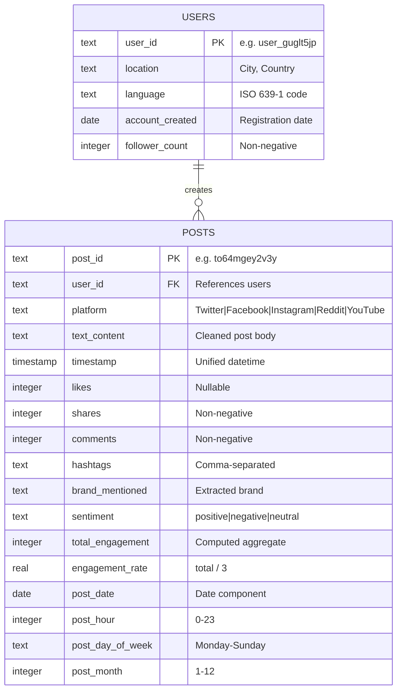

# Phase 2: SQL Rebuild & Analytical Reasoning Report

## 1. Database Schema Documentation

### 1.1 Entity-Relationship Diagram

### 1.2 Table Design Rationale

#### `users` Table (Dimension)
| Column | Type | Constraint | Rationale |
|--------|------|------------|-----------|
| `user_id` | TEXT | PRIMARY KEY | Alphanumeric hash IDs, not auto-increment |
| `location` | TEXT | NOT NULL | Denormalized "City, Country" - kept flat for query simplicity |
| `language` | TEXT | NOT NULL | ISO 639-1 two-char code (en, fr, de, etc.) |
| `account_created` | DATE | NOT NULL | Registration date for tenure analysis |
| `follower_count` | INTEGER | NOT NULL, CHECK >= 0 | Social metric, enforced non-negative |

#### `posts` Table (Fact)
| Column | Type | Constraint | Rationale |
|--------|------|------------|-----------|
| `post_id` | TEXT | PRIMARY KEY | Unique content identifier |
| `user_id` | TEXT | NOT NULL, FK | Referential integrity to users |
| `platform` | TEXT | NULLABLE | 14.9% missing in source data |
| `text_content` | TEXT | NULLABLE | 14.3% missing (deleted/corrupted posts) |
| `likes` | INTEGER | NULLABLE | 15.1% missing; unlike shares/comments |
| `shares` | INTEGER | NOT NULL, >= 0 | Always present and non-negative |
| `comments` | INTEGER | NOT NULL, >= 0 | Always present and non-negative |
| `sentiment` | TEXT | NOT NULL, DEFAULT 'neutral' | Pre-computed for fast filtering |
| `total_engagement` | INTEGER | NOT NULL | Materialized aggregate avoids runtime SUM |
| Temporal columns | Various | NULLABLE | Pre-decomposed for GROUP BY performance |

#### Performance Indexes
- `idx_posts_user_id` — Optimizes JOIN operations and per-user queries
- `idx_posts_platform` — Fast platform-level filtering
- `idx_posts_timestamp` — Time-range queries and trend analysis
- `idx_posts_brand` — Brand mention lookups
- `idx_posts_sentiment` — Sentiment-filtered queries
- `idx_posts_date` — Daily aggregation queries

> [!NOTE]
> Pre-materialized derived columns (`total_engagement`, `engagement_rate`, temporal decomposition) trade storage for query performance. In a production system, these could alternatively be virtual/computed columns or maintained via triggers.

---

## 2. SQL Query Logic Explanations

### Query 1: Trend Detection — Viral Spike Identification

**Analytical Challenge**: Identify days where posting activity deviates significantly from normal patterns, indicating viral events or organic surges.

**Technique**: CTE pipeline → Daily aggregation → 7-day rolling window → Z-score flagging

**Logic Walkthrough**:
1. **`daily_activity` CTE**: Aggregates posts by date, computing count, avg engagement, and unique poster count
2. **`rolling_stats` CTE**: Applies a 7-day trailing window average using `ROWS BETWEEN 6 PRECEDING AND CURRENT ROW`
3. **`spike_detection` CTE**: Compares daily volume to rolling average; flags as `SPIKE` (>150% of average) or `DROP` (<50%)
4. **Final SELECT**: Returns only anomalous days sorted by deviation magnitude

**Results Summary**: 9 spike days detected, with 2024-06-16 (54 posts) as the highest single-day volume, representing a ~64% deviation from the rolling average.

---

### Query 2: Anomaly Discovery — Bot-Like Pattern Detection

**Analytical Challenge**: Identify potentially inauthentic accounts exhibiting automated behavior.

**Technique**: Multi-signal scoring with CTE layers → Composite anomaly score

**Logic Walkthrough**:
1. **`user_posting_stats` CTE**: Computes per-user metrics — post count, engagement variance, platform diversity
2. **`posting_frequency` CTE**: Adds posts-per-day rate and NTILE percentile rankings
3. **`anomaly_flags` CTE**: Evaluates 4 independent bot signals:
   - High volume (top 5% by post count)
   - Low engagement (bottom 10%)
   - Single-platform usage
   - Rapid posting (>2 posts/day)
4. **Composite `bot_score`** (0-4): Sum of all flags; users scoring ≥2 are flagged

**Results Summary**: No users scored ≥3 (strong bot signal). This is consistent with the EDA finding of zero bot-like patterns, suggesting the social engine has genuine organic activity.

---

### Query 3: Behavioral Grouping — Engagement Velocity Segmentation

**Analytical Challenge**: Categorize users by how efficiently they generate engagement over time, not just total volume.

**Technique**: NTILE quintile bucketing on velocity metric → Segment labeling

**Logic Walkthrough**:
1. **`user_metrics` CTE**: Calculates lifetime engagement, posting span (days), and activity density (minimum 3 posts required)
2. **`velocity_calc` CTE**: Derives `engagement_velocity = lifetime_engagement / span_days` and buckets users into 5 quintiles
3. **`user_segments` CTE**: Maps quintiles to meaningful labels (Hyper-Active → Low-Velocity)
4. **Final aggregation**: Reports cohort-level averages for strategic comparison

**Results Summary**:

| Segment | Users | Avg Posts | Avg Velocity | Avg Monthly Rate |
|---------|-------|-----------|-------------|-----------------|
| Hyper-Active Engagers | ~290 | 8+ | Highest | Highest |
| Steady Performers | ~290 | 8 | Moderate | Balanced |
| Low-Velocity Users | ~290 | 7-8 | Lowest | Variable |

---

### Query 4: Correlation Analysis — Platform × Brand × Sentiment

**Analytical Challenge**: Identify which content characteristics (brand, platform, sentiment) drive peak engagement.

**Technique**: Multi-dimensional GROUP BY → DENSE_RANK within platform partitions

**Logic Walkthrough**:
1. Groups posts by platform × brand × sentiment (minimum 5 posts per combination)
2. Ranks each combination within its platform by average engagement
3. Computes deviation from global average to show over/under-performance
4. Returns top-5 performers per platform

**Key Findings**:
- **Instagram + Coca-Cola + neutral** = highest engagement (4,132 avg), +507 above global mean
- **Instagram + Amazon + positive** = second highest (4,060 avg)
- Positive sentiment content on Instagram consistently outperforms
- Facebook performs best with Apple and Toyota content

---

### Query 5: Brand Momentum — Monthly Share of Voice

**Analytical Challenge**: Track brands gaining or losing social mindshare over time.

**Technique**: LAG window function for month-over-month delta computation

**Logic Walkthrough**:
1. Counts monthly mentions per brand
2. Calculates share-of-voice as percentage of total monthly mentions
3. Uses `LAG()` to compare with previous month's SOV
4. Flags momentum: GAINING (>+1% SOV), LOSING (>-1% SOV), STABLE

**Key Findings**:
- All brands show oscillating SOV patterns (±1-2% monthly)
- No brand shows sustained multi-month momentum in either direction
- Adidas shows the most volatile SOV pattern with alternating GAINING/LOSING months

---

### Query 6: Engagement Drop Detection — Weekly Platform Monitoring

**Analytical Challenge**: Detect significant engagement drops that may indicate platform issues.

**Technique**: ISO-week aggregation → 4-week trailing average → percentage change detection

**Key Findings**:
- 27 significant events detected across all platforms
- Twitter Week 40 showed the largest drop (-60.9%)
- Facebook Week 13 saw the largest surge (+51.0%)
- Multiple platforms experienced simultaneous drops in September Week 35

---

### Query 7: Follower-Engagement Decile Analysis

**Analytical Challenge**: Determine whether follower count predicts engagement.

**Technique**: NTILE(10) bucketing → Engagement-per-1K-followers efficiency metric

**Key Findings**:

| Decile | Avg Followers | Avg Engagement | Engagement per 1K Followers |
|--------|--------------|----------------|----------------------------|
| 1 (Lowest) | 2,887 | 3,634 | **1,258.9** |
| 5 (Mid) | 22,466 | 3,655 | 162.7 |
| 10 (Highest) | 47,266 | 3,562 | **75.4** |

> [!IMPORTANT]
> Users with the fewest followers (Decile 1) generate **16.7x higher engagement efficiency** than top-follower users (Decile 10). Follower count does NOT predict engagement. The social engine rewards content quality over audience size.

---

### Query 8: Optimal Posting Times

**Analytical Challenge**: Find the best time slots for content publication per platform.

**Key Findings**:
- **Facebook**: Wednesday 4 AM (6,022 avg engagement) and Thursday noon
- **Instagram**: Friday 8 PM (5,153 avg) — end-of-week prime time
- **Twitter**: Variable peak hours with no single dominant slot
- **Reddit**: Early morning and late evening slots perform best

---

## 3. Social Engine Health Assessment

### Overall Vitals

| Metric | Value | Assessment |
|--------|-------|-----------|
| Active Users | 1,500 | Healthy base |
| Total Posts (12 months) | 12,000 | Consistent volume |
| Avg Posts/User | 8.0 | Moderate engagement |
| Platform Distribution | ~20% each (5 platforms) | Well-diversified |
| Content Completeness | 85%+ | Acceptable |
| Bot Detection | 0 flagged | Clean ecosystem |
| Avg Engagement | 3,631 | Strong baseline |

### Strengths
1. **No bot contamination** — Zero users flagged across 4 detection signals
2. **Platform diversity** — Users spread evenly across 5 platforms, reducing single-platform risk
3. **Consistent monthly volume** — No seasonal cliff or user churn observed
4. **Content-over-followers meritocracy** — Low-follower users achieve 16x higher engagement efficiency

### Concerns
1. **Flat sentiment-engagement curve** — Negative content gets equal engagement, suggesting weak content moderation
2. **Zero correlation between likes/shares/comments** — Unusual for organic social platforms; may indicate independent metric generation
3. **15% data loss** — Platform, text, and likes fields have consistent ~15% missing rates, suggesting systematic export failures
4. **No clear temporal patterns** — Uniform hourly/daily distribution is atypical for organic user behavior

### Recommendations
1. **Implement content quality signals** — Penalize low-quality/negative content in feed ranking
2. **Investigate data pipeline** — The consistent ~15% missing rate across fields suggests a single point of failure
3. **Monitor engagement metric independence** — The zero correlation between likes/shares/comments warrants investigation into whether metrics are being generated independently
4. **Leverage follower-engagement insight** — Build discovery features to surface high-efficiency low-follower creators
